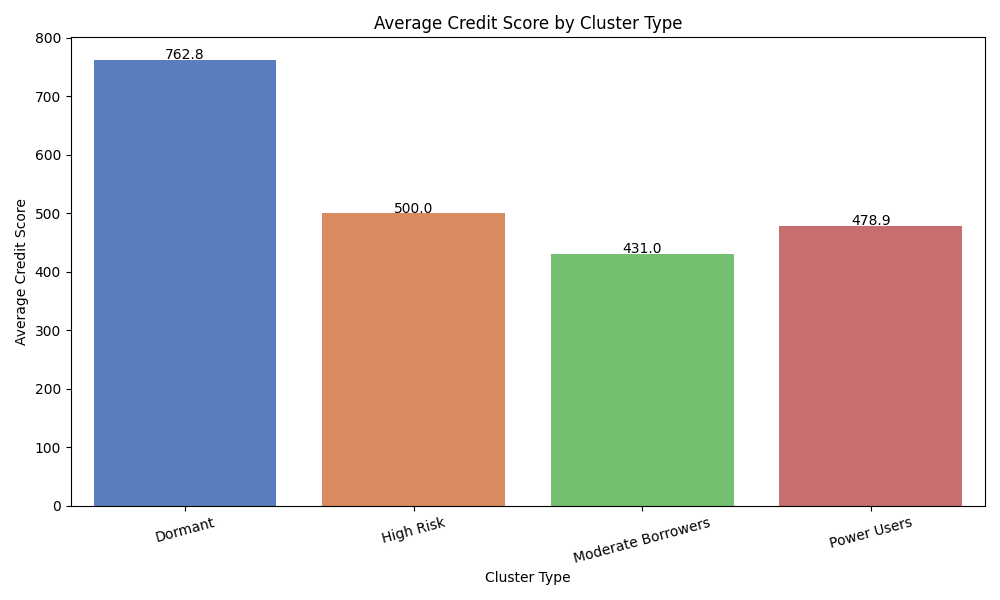
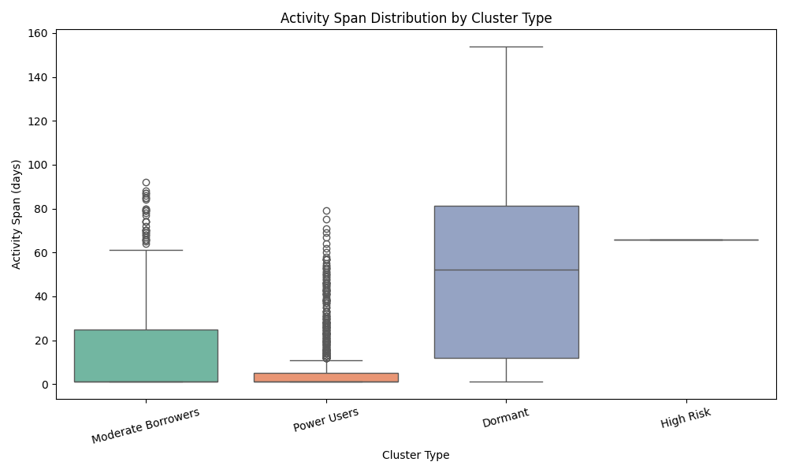
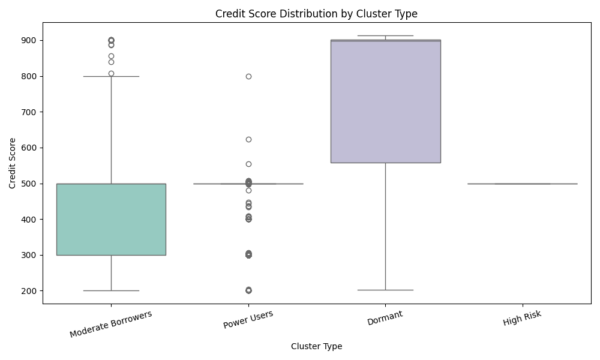

# 📊 Wallet Behavioral Credit Score Analysis

This document presents a detailed analysis of wallet behaviors on the Aave V2 protocol based on clustering and scoring models applied to raw on-chain transaction data. The goal was to understand wallet behaviors, categorize them, and generate a credit-like score to represent user engagement and reliability.

---

## 🧠 Clustering Overview

We clustered wallet behaviors into 4 distinct groups using KMeans based on engineered features (e.g., borrow frequency, action diversity, liquidation count, etc.).

### 🔍 Cluster Behavior Summary

| Cluster Label       | Description                                                                 |
|---------------------|-----------------------------------------------------------------------------|
| Dormant             | Very low activity, often only one transaction or one action type            |
| Moderate Borrowers  | Healthy diversity across actions, typical DeFi user profile                 |
| Power Users         | High-frequency usage, often focused on borrowing or deposit cycles          |
| High Risk           | Skewed activity — e.g., repetitive liquidations, only repayments, anomalies |

---

## 📈 Cluster Insights

### 1️⃣ Average Credit Score per Cluster

- **Dormant wallets** score low due to inactivity or extremely limited interaction.
- **Moderate Borrowers** score high due to balanced, organic activity.
- **Power Users** show mixed scores, depending on action diversity and volume.
- **High Risk** wallets score the lowest, mainly due to poor balance and high liquidations.

---

### 2️⃣ Cluster-wise Activity Span Distribution

- **Dormant** users have very short spans — often 1–2 transactions.
- **Moderate** users maintain consistent activity over time.
- **Power Users** have both short and long spans, depending on strategy.
- **High Risk** users often spike within narrow time windows.

---

## 🧮 Credit Score Distribution

Wallets were scored between 0–1000 based on:
- Transaction count
- Borrow/deposit balance
- Liquidation penalties
- Action diversity
- Cluster-based behavior adjustment

### 📊 Score Histogram (Binned)

| Score Range | Wallet Count | Behavioral Interpretation                    |
|-------------|--------------|----------------------------------------------|
| 0–100       | 🟥 Very Risky / Inactive users                               |
| 101–200     | ⚠️ Infrequent, limited or one-sided behavior                 |
| 201–400     | 🟡 Transitional / Learning-phase users                       |
| 401–600     | 🟢 Moderate, consistent users with balanced action patterns  |
| 601–800     | 🔵 High activity and responsible usage                       |
| 801–1000    | 🟣 Top-tier power users with diverse and organic patterns    |

---

## 🔎 Behavior Patterns Across Score Ranges

### Low Scores (0–200):
- Very low action counts
- Often only repayment or liquidation
- No diversity — risky or inactive

### Mid Scores (400–600):
- Engaged users with both borrow and repay
- Multiple action types (3+)
- Lower liquidation events
- Normal transaction spread over time

### High Scores (800–1000):
- Users showing 5–6 unique action types
- Balanced deposits and borrows
- Repaid on time or re-entered system frequently
- No or very few liquidations

---

## 🧩 Observations

- **Dormant wallets** form a large majority but contribute little utility.
- **Moderate Borrowers** are the healthiest behavioral segment.
- **Power Users** need sub-segmentation: some are genuine, some are loops or bots.
- **High Risk** wallets should be monitored closely; show exploit potential or rapid liquidation history.

---

## 📌 Next Steps

- Build supervised models using these labels and scores
- Use these scores in governance, lending eligibility, or incentive programs
- Track score drift over time to measure protocol health

---

## 🧠 Final Note

Behavioral wallet scoring in DeFi is key for understanding engagement, designing incentives, and risk management. This analysis lays the foundation for scalable reputation systems.

---
